# __Portfolio Project 3 - Python__
## __ChrisSweeper: Mine Hunter__

### __Demo__

The live site can be viewed here - [ChrisSweeper: Mine Hunter](https://chrisweeper-minehunter-70712a3a8751.herokuapp.com/)

Github repository can be viewed here - [CMed01/portfolio-milestone-3](https://github.com/CMed01/portfolio-milestone-3)

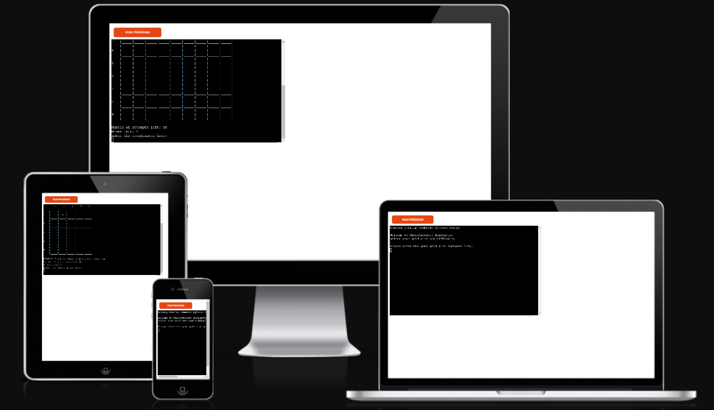

## Table of Contents
* [User Experience](#user-experience)
* [Technologies](#technologies)
* [Testing](#testing)
* [Deployment](#deployment)
* [Credits](#credits)

## __User Experience__

### __Strategy__
The aim of the website is to display an interactive mine searching game.
Reasons for the site:
* Enjoyment
* User interaction

#### __User Stories__
* As a user I want to be able to:
    * Easily understand the main purpose of the website.
    * Easily navigate the website to find and interact with the content.
    * Easily understand the instructions of the game.
    * Specify the size of the mine grid before starting the game, adjusting the difficulty.
    * Generate a game grid with randomly generated mines equal to the width of the grid. The values of each grid square will initially be hidden from view
    * View the number of mines left to detect and the number of attempts remaining to locate all the mines
    * Input coordinates to reveal grid squares and gain knowledge of the number of mines in the surrounding grid squares.
    * Gain information of the number of mines surrounding
    * View the complete grid layout and location of mines and remaining square values when either all mines have been found or attempts have run out.

* As a developer I want:
    * The user to be able to change the level of difficulty by allowing them functionality to determine the size of the grid.
    * The user to have a limited number of attempts to find all mines, so that the game presents a challenging and engaging experience.
    * The user to be able to track their progress, with information detailing the number of mines and lives remaining as well as an updated mine grid.

### __Scope__
Functionally the site must be:
* Easy to navigate.
* Input functionality working.
* The terminal to clear after each successful input.
* Clear information given if incorrect inputs are made.

Content should include the following:
* Provide the user with the rules of the game.
* Provide interactive functinality to play the game.

### __Structure__
Based on the content required in the scope of this project, this website will consist of one page. The page will contain a simple structure with an embedded terminal. Within the terminal will be the interactive function of this game.

### __Skelton (Lucidchart)__
As the template for the front-end website design is pre-set. There are no wireframes included in this readme. [Lucidchart](https://www.lucidchart.com/) was used to create the process map for the game logic.

Process map 

 

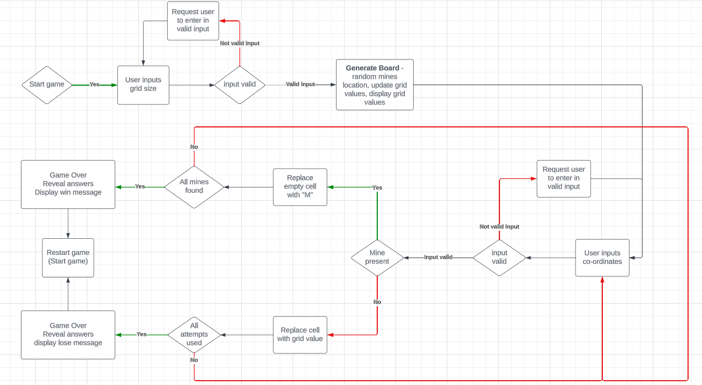

### __Surface (including Features)__

#### __Features__
1.  __Initial screen__
     
    On loading the page the user is greeted with a welcome message and prompted to enter a numerical number to determine the grid size and difficulty
    
    

    
 Loading screen 

     

    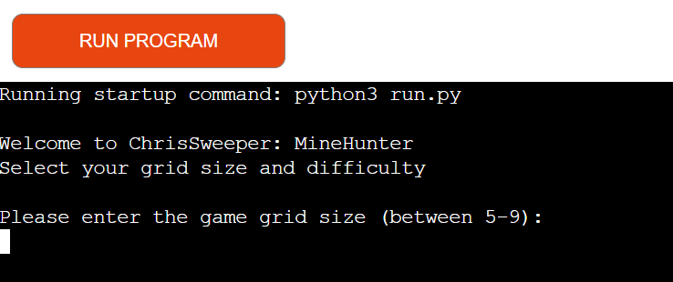

    

     

2. __Grid display__
     
    After entering a value between 5 and 9, the terminal is cleared and a square grid is displayed with blank values.
     
    Underneath the grid an attempt and mines left counter are printed to the terminal.
     
    The number of mines is proportional to the grid size.
     
    The number of attempts is twice as large as the grid size.
     
    A new input message is displayed requesting the user to enter two numbers separated by a space in the terminal
     
    A game title and instructions are also printed at the top of the screen.

    

    
Game grid 

     

    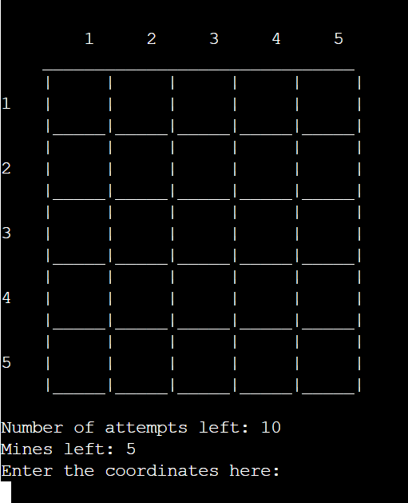

    

    

    
Larger game grid 

     

    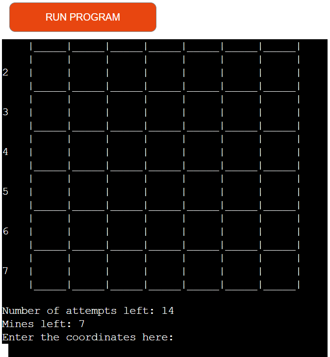
    

    

    
Instructions 

     

    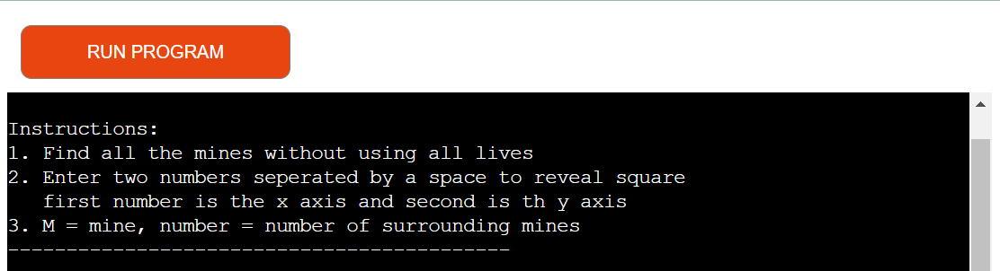

    

     
         

3. __Coordinate guess__
     
    After the user enters two numbers as per the displayed instructions, the relavent square is revealed.
     
    The terminal is cleared.
     
    If a mine is present, a "M" is printed in the grid and the mine counter is reduced by 1
     
    If a mine is not present, a numerical number is printed in the grid and the attempt counter is reduced by 1. This number represents the number of mines in the adjacent grid spaces, further adding clues to the whereabouts of the remaining mines.
     
    The user can continue to enter coordinates until all the mines are found or all attempts have been used.
    
    

    
Coordinate entry 

     

    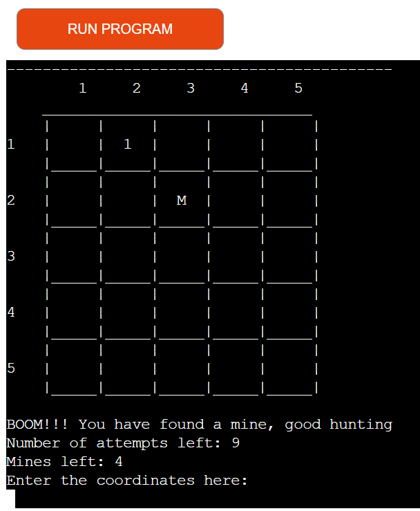

    

      

4. __Input validity__
     
    If the user does not enter a number greater than or equal to 5 or less than or equal to 9, then an error message is printed to the terminal. The user is requested to re-enter a valid number.
     
    If the user does not enter the correct coordinates of two single digit numbers separated by a space then an error message is printed to the terminal. The user is requested to re-enter.
     
    If the user enters a coordinate that has already been entered previously. A message is printed to inform the user of a duplicate guess. The mine or attempt counts are not affected.
    

    
Validation - grid size 

     

     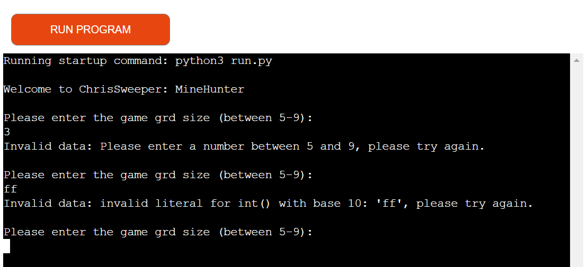

    

    

    
Validation - coordinates 

     

     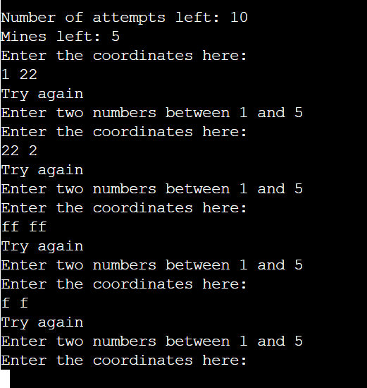 

    

   
    

    
Validation - duplicate guesses 

     

     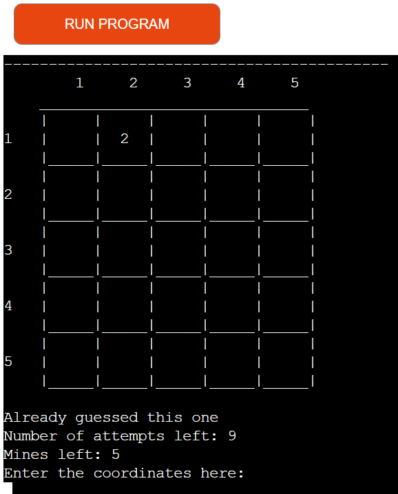

    

     

5. __Game End__
     
    If the user successfully find all the mines before the attempt counter reaches zero then a winning message is displayed.
     
    If the user does not locate all the mines before the attempt counter reaches zero then a game over message is displayed.
     
    On both occasions the user is prompted to click the "Run Program" to restart the game
    

    
Game won

     

     

    

    

    
Game lost 

     

     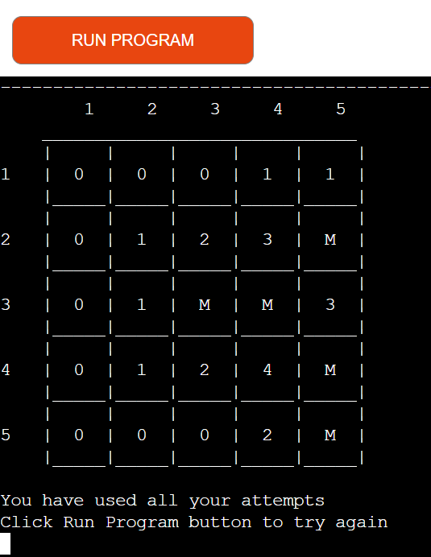 

    

     

6. __Future additions__
    * Can add functionality, that is a cell is revealed and the contents equal 0. Then all the cells surrounding it that equal 0 will be revealed. The revealing of neighboring cells will stop when a numerical value greater than 1 is met. This will need thought of how to implement a recursive function and was not achievable in the time frame for this project.
    * As like a traditional minesweeper game, can add functionality to mark cells that the user thinks may be a mine. This can help add to the enjoyment of the game especially when the grid size increases in size. This will involve adding a further level of data to the game logic.
    * The game terminal is pre-set and in future would look to increase the terminal size so that gird sizes larger than 9 can be chosen for those users eager for a significant challenge.
    * At the moment, the user can only modify the grid size. A consideration for the future can be that the user also enters the number of attempts they start with, again to increase or decrease difficulty.

## __Technologies__

### __Languages__

* Python

### __Frameworks, programs and libraries__

* [Lucidchart](https://www.lucidchart.com/) - Used to create a process map for the game logic.
* [Am I Responsive?](https://ui.dev/amiresponsive) - Used to create an image of the website on various screen sizes.
* [BrandCrowd](https://www.brandcrowd.com/) - Used to create a logo.
* [Heroku](https://www.heroku.com/) - Used to deploy the website

## __Testing__
### __Validator testing__

* __[CI Python Linter](https://pep8ci.herokuapp.com/)__
    - All clear, no errors found
    - 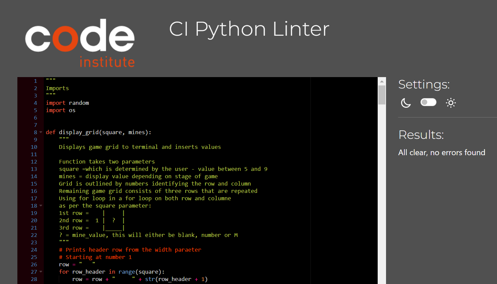

### __Browser Compatability__
* Not tested

### __Test Cases and Results__

The below table details the test cases that were used. 

 

| Test Number | Test Label                        | Test Action                                                                               | Expected Outcome                                                                                                                                                                                                                                                                                                                                                                                                                                                                                                                                                                                                                                                                                                                                                                                                                                                                                                                                                                                                                                                                                     | Test Outcome |
|-------------|-----------------------------------|-------------------------------------------------------------------------------------------|------------------------------------------------------------------------------------------------------------------------------------------------------------------------------------------------------------------------------------------------------------------------------------------------------------------------------------------------------------------------------------------------------------------------------------------------------------------------------------------------------------------------------------------------------------------------------------------------------------------------------------------------------------------------------------------------------------------------------------------------------------------------------------------------------------------------------------------------------------------------------------------------------------------------------------------------------------------------------------------------------------------------------------------------------------------------------------------------------|--------------|
| T01         | Initial page load                 | Load page                                                                                 | Page loads with not error message printed to the terminal Welcome message is displayed Input message asking for number between 5 and 9                                                                                                                                                                                                                                                                                                                                                                                                                                                                                                                                                                                                                                                                                                                                                                                                                                                                                                                                                               | Pass         |
| T02         | User input - grid size            | Enter number input Enter string input                                                     | If number between 5 and 9 entered (i.e. 5, 6, 7, 8, 9): Terminal is cleared and replaced with the game title, instructions and a grid with empty values.  If number not between 5- and 9 entered: An error message is displayed and the user is prompted to enter another input.                                                                                                                                                                                                                                                                                                                                                                                                                                                                                                                                                                                                                                                                                                                                                                                                                     | Pass         |
| T03         | Grid Display                      | Enter number between 5-9 when prompted for grid size                                      | The grid displayed will be a square of width and height equal to the user input for grid size. The grid will have numbers bordering the height and width. These will be starting from 1 and including the grid size entered There grid value will be empty Underneath the displayed grid, the number of attempts and mines left is also displayed. These values will be: Attempts = grid size * 2 Mines left = grid size A final message will be printed to the terminal asking for the user to enter coordinates                                                                                                                                                                                                                                                                                                                                                                                                                                                                                                                                                                                    | Pass         |
| T04         | User input - Coordinates          | Enter correct numbers Enter incorrect numbers                                             | If the numbers entered are correct and grid value not displayed: The terminal will clear and a new grid will be printed to the terminal. The corresponding grid square value will now be displayed. I.e. 1 2 entered then row 1, column 2 will have the value displayed on the grid The title and instructions will be displayed above the grid. The mine and attempts left will be displayed below the grid User input is prompted again for next co-ordinates If the numbers entered are correct and grid value are displayed: The terminal will clear and a new grid will be printed to the terminal. A message will be printed below the grid to state that that guess has already been made The title and instructions will be displayed above the grid. The mine and attempts left will be displayed below the grid User input is prompted again for next co-ordinates If the numbers entered are incorrect: The terminal will clear and a new grid will be printed to the terminal. An error message is displayed No grid values are added User input is prompted again for next co-ordinates | Pass         |
| T05         | Counter - mines and attempts left | Enter in correct coordinates                                                              | With each successful entry of correct coordinates. If a mine is identified the mine counter is reduced by one If a mine is not identified the attempt counter is reduced by one  If the user enters a coordinate of a square where the value is already known. Neither counters will be reduced and as per T04, a message stating already guessed will appear.                                                                                                                                                                                                                                                                                                                                                                                                                                                                                                                                                                                                                                                                                                                                       | Pass         |
| T06         | All mines found                   | Enter in correct coordinates of all mine locations and reduce the mines left counter to 0 | Once all mines have been identified before the attempt counter has reached zero. The terminal is cleared and a grid will all the values are displayed A winning message will appear, congratulating the player and informs them how many attempts were left. The player is also asked to give the game another go by clicking on the Run Program button                                                                                                                                                                                                                                                                                                                                                                                                                                                                                                                                                                                                                                                                                                                                              | Pass         |
| T07         | All attempts used                 | Enter in correct coordinates of non-mine locations and reduce the attempt counter to 0    | Once all attempts have been identified before the mines left counter has reached zero. The terminal is cleared and a grid will all the values are displayed A losing message will appear, asking the player to give the game another go by clicking on the Run Program button                                                                                                                                                                                                                                                                                                                                                                                                                                                                                                                                                                                                                                                                                                                                                                                                                        | Pass         |
| T08         | Run Program button                | Click Run Program button                                                                  | At any point during the game when the Run Program button is clicked. The terminal resets and returns the initial page as stated in T01                                                                                                                                                                                                                                                                                                                                                                                                                                                                                                                                                                                                                                                                                                                                                                                                                                                                                                                                                               | Pass         |

### __Debugging__
The "clear terminal" function employed throughout my python code works perfectly in the terminal of GitPod. However when deployed on Heroku the whole terminal is not being cleared when the "clear terminal" function is called. 

Following a discussion with the tutor support team, I discovered that _when running a Python terminal game and deploying it to a platform like Heroku, the os.system("clear") command may not clear the entire terminal because Heroku runs your application in a virtualised environment and does not have direct access to the terminal. Heroku typically captures the output of my application and displays it in a web-based console or logs. So, the clear command will only clear the output within that specific console or log area, rather than the entire terminal._

To try get around this I had to stop reprinting the rules and game title as these would not be cleared when the game was running, preventing duplication of print statements at the top of the terminal.

Although the above works if the user selects a grid size of 5. For larger grid sizes, the problem still occurs and I have been unable to fix this issue in the terminal when deployed via Heroku. The game function remains unaffected.

Heroku bug one 

 

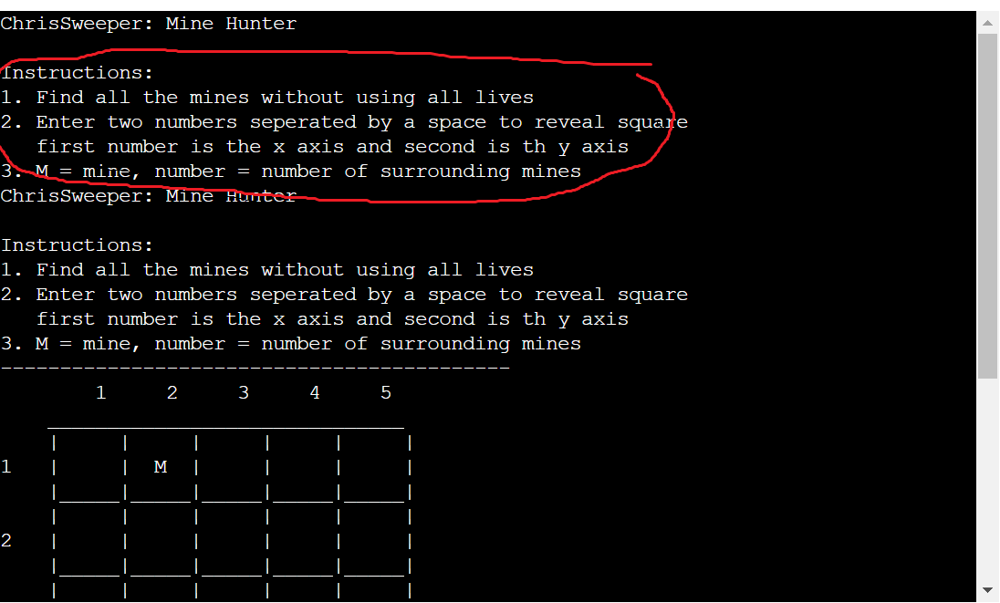 

Heroku bug two 

 

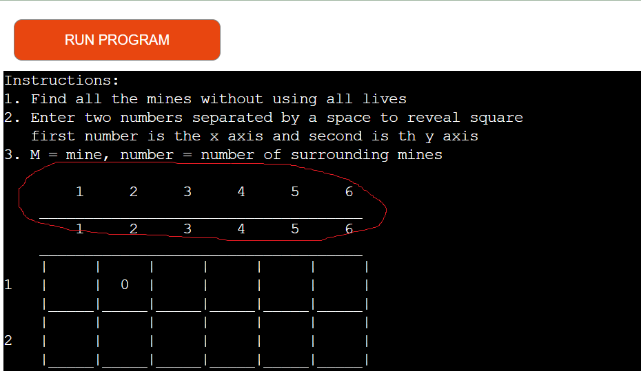 

## __Deployment__

### __How this site was deployed__

1. Open an account with Heroku.

2. On the home dashboard of your account, select "New" then "Create new app".

3. Create an unique app name, select the region and click create.

3. Click on the _Settings_ tab and add the following build packs:
    * `heroku/python`
    * `heroku/nodejs`

4. Create the following a _Config Var_ called `PORT`. Set this to `8000`

5. Click on the _Deploy_ tab and connect with GitHub.

6. Select the correct repository.

7. Chose between automatic deploy manual deploy.

8. Once successfully deployed you can visit the working website.

### __How to clone the repository__

1. Go to the 
 repository on GitHub.

2. Click the "Code" button to the right of the screen, click HTTPs and copy the link there

3. Open a GitBash terminal 

4. Change the working directory to the location where you want the clone directory.

5. On the command line, type "git clone" then paste in the copied url (https://github.com/CMed01/portfolio-milestone-2.git) and press the Enter key to begin the clone process

## __Credits__

### __Content__

* All content was written by the developer

### __Code__

* [AskPython](https://www.askpython.com/python/examples/create-minesweeper-using-python) - code on how to navigate between neighboring cells was based on an example from this website.

### __Acknowledegements__

I would like to express my gratitude to my mentor Brian Macharia, for his guidance, support and encouragement throughout my second project. I would also like to thank Joshua from the Code Institute support team for helping me to solve a rather frustrating bug when deploying my project to Heroku.