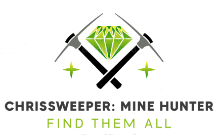
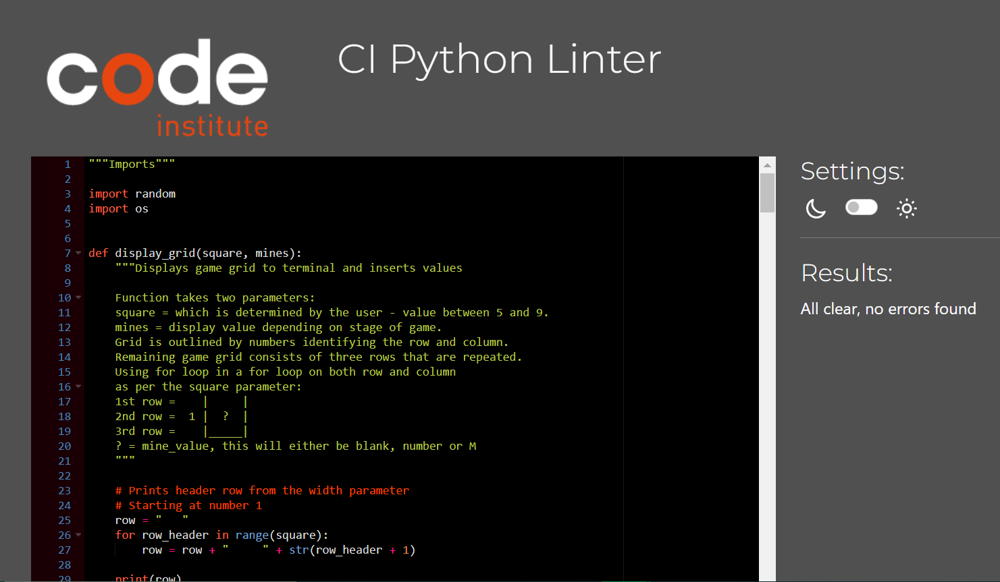

Welcome Christopher Meddings,

This is the Code Institute student template for deploying your third portfolio project, the Python command-line project. The last update to this file was: **August 17, 2021**

## Reminders

* Your code must be placed in the `run.py` file
* Your dependencies must be placed in the `requirements.txt` file
* Do not edit any of the other files or your code may not deploy properly

## Creating the Heroku app

When you create the app, you will need to add two buildpacks from the _Settings_ tab. The ordering is as follows:

1. `heroku/python`
2. `heroku/nodejs`

You must then create a _Config Var_ called `PORT`. Set this to `8000`

If you have credentials, such as in the Love Sandwiches project, you must create another _Config Var_ called `CREDS` and paste the JSON into the value field.

Connect your GitHub repository and deploy as normal.

## Constraints

The deployment terminal is set to 80 columns by 24 rows. That means that each line of text needs to be 80 characters or less otherwise it will be wrapped onto a second line.

-----
Happy coding!

# __Portfolio Project 3 - Python__
## __ChrisSweeper: Mine Hunter__

### __Demo__

The live site can be viewed here - [ChrisSweeper: Mine Hunter](https://chrisweeper-minehunter-70712a3a8751.herokuapp.com/)

Github repository can be viewed here - [CMed01/portfolio-milestone-3](https://github.com/CMed01/portfolio-milestone-3)

## Table of Contents
* [User Experience](#user-experience)
* [Technologies](#technologies)
* [Testing](#testing)
* [Deployment](#deployment)
* [Credits](#credits)

## __User Experience__

### __Strategy__
The aim of the website is to display an interactive mine searching game.
Reasons for the site:
* Enjoyment
* User interaction

#### __User Stories__
* As a user I want to be able to:
    * Easily understand the main purpose of the website.
    * Easily navigate the website to find and intereact with the content.
    * Easily understand the instructions of the game.
    * Specify the size of the mine grid before starting the game, adjusting the difficulty.
    * Generate a game grid with randomly generated mines equal to the width of the grid. The values of each grid square will initially be hidden from view
    * View the number of mines left to detect and the number of attempts remaining to locate all the mines
    * Input co-ordinates to reveal grid squares and gain knowledge of the number of mines in the surrounding grid squares.
    * Gain information of the number of mines surrounding
    * View the complete grid layout and location of mines and remaining square values when either all mines have been found or attempts have run out.

* As a developer I want:
    * The user to be able to change the level of difficulty by allowing them functionailty to determine the size of the grid.
    * The user to have limited number of attempts to find all mines, so that the game presents a challenging and engaging experience.
    * The user to be able to track their progress, with information detailing the number of mines and lives remaining as well an updated mine grid.

### __Scope__
Functionally the site must be:
* Easy to navigate.
* Input functionality working.
* The terminal to clear after each successful input.
* Clear information given if incorrect inputs are made.

Content should include the following:
* Provide the user with the rules of the game.
* Provide interactive functinaility to play the game.

### __Structure__
Based on the content required in the scope of this projct, this website will consist of one page. The page will contain a simple structure with an embedded terminal. Within the terminal will be the interactive function of this game.

### __Skelton (Lucidhart)__
As the template for the front-end website design is pre-set. There are no wireframes included in this readme. [Lucidchart](https://www.lucidchart.com/) was used to create the process map for the game logic.

Process map 

 

### __Surface (including Features)__

#### __Features__
1.  __Initial screen__
     
    On loading the page the user is greeted with a welcome message and prompted to enter a numerical number to determine the grid size and difficulty
    
    

    
 Loading screen 

     

    

    

     

2. __Grid display__
     
    After entering a value between 5 and 9, the terminal is cleared and a square grid is displayed with blank values.
     
    Underneath the grid an attempt and mines left counter are printed to the terminal.
     
    The number of mines is proportional to the grid size.
     
    The number of attempts is twice a large as the grid size.
     
    A new input message is displayed requesting the user to enter two numbers seperated by a space in the terminal
     
    A game title and instructions are also printed at the top of the screen.

    

    
Game grid 

     

    

    

    

    
Larger game grid 

     

    
    

    

    
Instructions 

     

    

    

     
         

3. __Co-ordinate guess__
     
    After the user enters two numbers as per the displayed instructions, the relevent square is revealed.
     
    The terminal is cleared.
     
    If a mine is present, a "M" is printed in the grid and the mine counter is reduced by 1
     
    If a mine is not present, a numerical number is printed in the grid and the attempt counter is reduced by 1. This number represents the number of mines in the adjacent grid spaces, further adding clues to the wherabouts of the remaining mines.
     
    The user can conitnue to enter co-ordinates until all the mines are found or all attempts have been used.
    
    

    
Co-ordinate entry 

     

    

    

      

4. __Input validity__
     
    If the user does not enter a number greater than or equal to 5 or less than or equal to 9, then an error message is printed to the terminal. The user is requested to re-enter a valid number.
     
    If the user does not enter the correct coordinates of two single digit numbers separated by a space then an error message is printed to the terminal. The user is requested to re-enter.
     
    If the user enters a co-ordinate that has already been entered previously. A message is printed to inform the user of a duplicate guess. The mine or attempt counts are not affected.
    

    
Validation - grid size 

     

     

    

    

    
Validation - co-ordinates 

     

      

    

   
    

    
Validation - duplicate guesses 

     

     

    

     

5. __Game End__
     
    If the user successfully find all the mines before the attempt counter reaches zero then a winning message is displayed.
     
    If the user does not locate all the mines before the attempt counter reaches zero then a game over message is displayed.
     
    On both occassions the user is prompted to click the "Run Program" to restart the game
    

    
Game won

     

     

    

    

    
Game lost 

     

      

    

     

6. __Future additions__
    * Can add functionailty, that is a cell is revelaed and the contents equal 0. Then all the cells surrounding it that equal 0 will be revealed. The revealing of neighbouring cells will stop when a numerical value greater than 1 is met. This will need thought of how to implement a recursive function and was not acheivable in the time frame for this project.
    * As like a traditional game, can look to add functionaility to mark cells that the user thinks may be a mine. This can help add to the enjoyment of the game espcially when the grid size increases in size. This will involves added an further level of data to the game logic.
    * The game terminal is pre-set and in future would look to increase the terminal size so that gird-sizes larger than 9 can be chosen for those users eager for a significant challenge.
    * At the moment, the user can only modify the grid size. A consideration for future can be that the user also enters the number of attempts they start with, again to increase of decrease difficulty.

## __Technologies__

### __Languages__

* Python

### __Frameworks, programs and libraries__

* [Lucidchart](https://www.lucidchart.com/) - Used to create a process map for the game logic.
* [Am I Responsive?](https://ui.dev/amiresponsive) - Used to create an image of website on various screen sizes.
* [BrandCrowd](https://www.brandcrowd.com/) - Used to create a logo.
* [Heroku](https://www.heroku.com/) - Used to deploy the website

## __Testing__
### __Validator testing__

* __[CI Python Linter](https://pep8ci.herokuapp.com/)__
    - All clear, no errors found
    - 

### __Browser Compatability__
* Not tested

### __Test Cases and Results__

The below table details the test cases that were used. 

 

## __Deployment__

### __How this site was deployed__

1. Open an account with Heroku.

2. On the home dahsboard of your account, select "New" then "Create new app".

3. Create an unique app name, select the region and click create.

3. Click on the _Settings_ tab and add the following build packs:
    * `heroku/python`
    * `heroku/nodejs`

4. Create the following a _Config Var_ called `PORT`. Set this to `8000`

5. Click on the _Deploy_ tab and connect with GitHub.

6. Select the correct repository.

7. Chose between automatic deploy manual deploy.

8. Once successfully deployed you can visit the working website.

### __How to clone the repository__

1. Go to the 
 repository on GitHub.

2. Click the "Code" button to the right of the screen, click HTTPs and copy the link there

3. Open a GitBash terminal 

4. Change the working directory to the location where you want the clone directory.

5. On the command line, type "git clone" then paste in the copied url (https://github.com/CMed01/portfolio-milestone-2.git) and press the Enter key to begin the clone process

## __Credits__

### __Content__

* All content was written by the developer

### __Code__

* [AskPython](https://www.askpython.com/python/examples/create-minesweeper-using-python) - code on how to navigate between neighbouring cells was based on an exmaple fro this website.

### __Acknowledegements__

I would like to express my gratitude to my mentor Brian Macharia, for his guidance, support and encouragement throughout my second project.